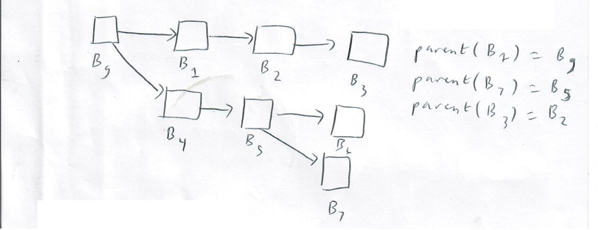
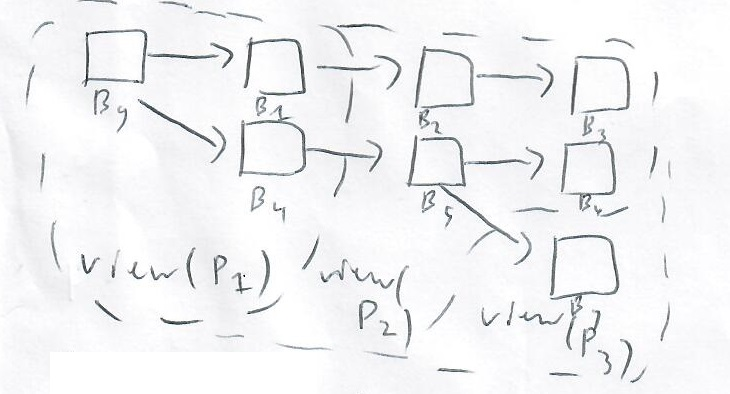
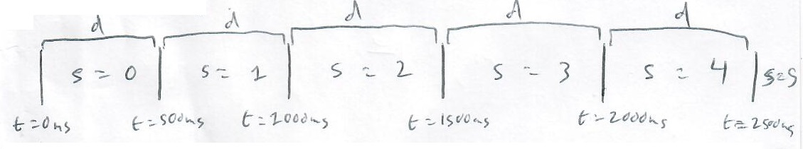
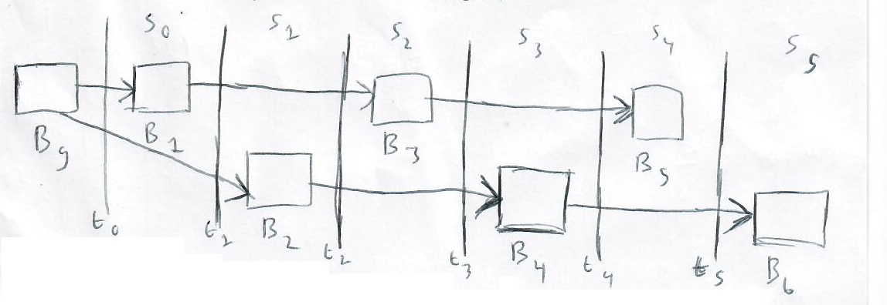

# The Starlight protocol

## Abstract
The Starlight protocol is a consensus algorithm that intends to fulfill Bitcoin's original ideal - that of a trustless, decentralized, convenient digital currency - to the highest degree.

TODO - improve the coherence + organization of this document

## Introduction
The state of the Starlight network is defined by the set of transactions on its blockchain. Instead of requiring mining or staking to extend the chain, Starlight adopts a slot-based mechanism. Time is divided into slots of a certain length (currently 500ms). For each slot, a validator is randomly selected, based on their weight, to be the leader for that slot, the unique account that is allowed to produce a block to extend the chain. Validators forward received transactions directly to the leader, who bundles them into a block, which is broken into shreds that are broadcast through the network.

Some blockchains, such as Bitcoin, rely on probabilistic finality: a transaction is never truly "irreversible", only more and more likely to be so as more and more blocks are built on top of it. Starlight, in contrast, provides deterministic finality. Every Starlight account selects a representative, a validator that they believe to be trustworthy. The sum of the balances of all the accounts who choose a certain validator as their representative make up that validator’s weight, their voting power in the Starlight consensus protocol. Validators vote for blocks using a slight variant of the Casper-FFG protocol, which provides a mathematical guarantee that so long as 66% of the network voting weight remains non-malicious, any block that is considered finalized will be forever accepted by all nodes. Starlight transactions typically achieve finality within 1 to 2 seconds.

## Leader schedule
Let us define an epoch boundary block as the block with the lowest slot in an epoch. Two blocks may conflict to be the epoch boundary block for a certain epoch, but after finalization, one of them will resolve as the winner.

Let us define the special block for a certain epoch as follows: the first epoch has no special block. For all subsequent epochs, their special block is the latest finalized epoch boundary block in existence, not including the epoch boundary block for their current epoch. For example, let's say we have two epochs, 0 and 1. Epoch 0 has no special block. Epoch 1's special block is defined as the finalized epoch boundary block of epoch 0. This holds true even if epoch 1 finalizes an epoch boundary block of its own. Note that two nodes may have different views of finality, and thus different views of the special block for an epoch. This is OK.

The Starlight leader schedule is defined as follows. For the first epoch containing the genesis block, the genesis account is the leader for all slots. For all subsequent epochs, the leader schedule is generated based on a weighted probability distribution:
- The accounts included in this distribution are all accounts who have finalized votes in the epoch preceding the epoch of the special block for that epoch.
- The weight of an account is the sum of the balances of its delegates.
- The distribution is generated by a deterministic pseudo-random number generator, seeded based on the special block's epoch number. The voters are sorted by their public key, to ensure the same results across all nodes.

## State preservation
Some blockchains, like Bitcoin, rely on all transactions to be replayed from genesis in order to build the ledger state; this becomes more and more difficult as time goes on. In a high-performance blockchain such as Starlight, it would be an unsustainable solution.

Starlight solves this problem by maintaining a merkle tree of all accounts at the current block, ordered by their indices. The root of this tree is included in that block as the `state_hash`.

Light clients can receive proofs against the state hash in order to verify the correctness of the state, e.g. the balance in their account.

## Cryptography
For key derivation, Starlight uses ed25519 with blake2b-512 as the key derivation function.
For hashing, Starlight uses blake3.

## Consensus
The Starlight protocol is built upon a set of accounts, each with a balance of SLT tokens. The balance in SLT of an account $A$ is denoted by $balance(A)$.

Each account delegates its balance to another account, its representative. The set of accounts that delegate to an account $A$ is denoted by $delegators(A)$. The weight of an account $A$ is the sum of the balances of its delegates:

$$weight(A) = \sum_{A_i \in delegators(A)} weight(A_i)$$

When $weight(A)$ exceeds a predefined threshold $T$, they are considered part of the set of principal representatives $\mathcal{S}_p$, i.e.,

$$S_p = \{A | weight(A) > T\}$$

At any time, a principal representative $P \in S_p$ may broadcast a message $M$ to all other principal representatives $P \in S_p$ in the network, who are assumed to be interconnected by network links. Messages form together the Starlight network state, and can be block proposals, votes, slashes, etc.; they can contain any arbitrary data.

Any message $M$ is delivered on a best-effort basis; ideally, all principal representatives in $S_p$ would receive every message $M$ instantly, but in practice this is impossible and not necessary for the protocol to function. It can be said that every message $M$ will eventually be received by every possible representative $P$, and this is sufficient for the protocol to work and to be secure.

It is also assumed that a function $author()$ exists for all messages $M$ such that $author(M) = P$ outputs the author of the message; i.e., messages cannot be forged, and impersonal attacks are impossible. In practice, $author()$ is implemented using cryptographic signatures.

A block $B$ is defined as a type of message that contains any arbitrary data as its payload; in Starlight, this would include smart contract executions. $B_g$ is the genesis block and the first message; it is the initial state of all principal representatives $P$, and is the only message for which $author()$ is undefined.

Each $B$ that is not $B_g$ has a parent block denoted by parent$(B)$. Thus, the set of all blocks $S_b$ forms a directed tree of blocks rooted at the genesis block $B_g$.

Two blocks conflict if neither is a descendant of the other. For example, blocks $B_1, B_2, B_3$ conflict with all blocks $B_4, B_5, B_6, B_7$, and $B_7$ conflicts with all blocks $B_1$ to $B_6$. For any block $B$, $chain(B)$ denotes the path starting at $B_g$ and ending at $B$. For example, $chain(B_2) = B_g \rightarrow B_4 \rightarrow B_5 \rightarrow B_1$. $chain(B_3) = B_g \rightarrow B_2 \rightarrow B_2 \rightarrow B_3$.

Recall from earlier that any message $M_B$ delivered to a principal representative $P$ on a best-effort basis, not instantly. Thus, any principal representative $P$ may have received only a subset of the set of all messages $S_m$ at any given time. This is formalized as the concept of a view: $\text{view}(P)$ for any principal representative $P$ is the set of messages that $P$ has received at the current time. By necessity $\text{view}(P)$ is a subset of all messages; i.e., $\text{view}(P) \subseteq S_m$.

The set of all blocks in any view can be visualized as before by a directed tree:

In this example, principal representative $P_1$ has seen blocks $B_g$, $B_1$, and $B_4$, $P_2$ has seen all blocks except $B_7$, and $P_3$ has seen all blocks.

Starlight is not a proof-of-work protocol like Bitcoin; thus, here are no inherent computational limits on block generation. Because Starlight lacks this, we turn to the next best limiter: time. The atomic unit of time in the Starlight protocol is a slot. The current slot is uniquely determined by the current time $t$, and vice versa; this is implemented through the setting of a slot delay $d$. For example, for $d = 500\text{ ms}$:

If time synchronization is so important to Starlight, then how does the protocol deal with the possibility of desynchronized clocks? The answer is that every message $M$ is stamped with a slot number $\text{slot}(M)$, and that no principal representative $P$ will process a message $M$ until its local slot number $s$ is greater than or equal to $\text{slot}(M)$. This condition alone is sufficient to ensure that if a supermajority of the network has a local slot number less than or equal to a certain slot number $s$, the network will neither confirm nor recognize any block with a slot number greater than $s$ (more on this later).

Through a deterministic pseudo-random number generator, the Starlight network generates a leader schedule $L$ according to a weighted probability distribution, where a principal representative $P$ with a higher weight$(P)$ has a higher chance of being selected for any given slot in the schedule. $L: S \rightarrow P$ is simply a list of principal representatives ordered by slot number; for any slot $s$, $L_s$ is called the leader for slot $s$.

The sole job of a leader during its allocated slot $s$ is to propose a new block $B$ to be added to the chain. $L_s$ is the only principal representative allowed to propose a block for slot $s$; if a block $B$ is presented with slot$(B) = s$ and author$(B) \neq L_s$, $B$ is unanimously rejected by all nodes.

    
Note that if the leader is offline during its assigned slot $s$, it is OK for the protocol; no block is produced and nothing is added to the chain.

So far, we have overviewed the concept of the time in the Starlight network, which is measured in slots, as well as blocks, their production by leaders, and the overall block tree. Now arises the question: how does the network determine a canonical blockchain - the "right" chain - to build off of? Equivalently, given two conflicting blocks - a fork - how does the network decide between them?

First, let's introduce the concept of a block-slot pair, or just a pair for short. A pair $I$ is denoted by the tuple $(B, s)$, where $B$ is a block and $s$ is a slot. For any pair $I = (B, s)$, $s \geq \text{slot}(B)$, or the pair is invalid.

We can now define a vote $V = I_1 \rightarrow I_2$ as a type of message, where $I_1$ and $I_2$ are pairs, slot($I_2$)  $>$ slot($I_1$), and block($I_2$) is a descendant, or child, of block($I_1$). slot($V$) = slot($I_1$) or the vote $V$ is invalid; i.e., a vote cast in a slot $s$ must target a par with that slot $s$.

We can now introduce the concept of pair recognition. For any view $W$, a park $I$ is recognized in $(I \subseteq R(W))$, if it satisfies any of the following two rules:

- Genesis Rule: $(B_g, 0) \in R(W)$

- Recognition Rule: $(B_2, S_2) \in R(W)$ if there exists a pair $(B_1, S_1) \in R(W)$ where the total weight of all votes $V = (B_1, S_1) \rightarrow (B_2, S_2)$ exceeds $\frac{2}{3}$ of the total weight of all principal representatives $S_p$; i.e., $\sum_{V = (B_1, S_1) \rightarrow (B_2, S_2) \in W} \text{weight}(\text{author}(V)) > \frac{2}{3} \sum_{p \in S_p} \text{weight}(P)$. In this condition, we write $(B_1, S_1) \xrightarrow{R} (B_2, S_2)$.

Next, we introduce the concept of pair confirmation; a pair $I$ is confirmed in $W$ ($I \subseteq C(W)$) if it satisfies any of:

- Genesis Rule: $(B_g, 0) \in C(W)$

- Confirmation Rule: $(B_s, S) \in C(W)$ if, for some $k \geq 1$:

$\rightarrow$ (C1) $(B_0, s), (B_1, s + 1), \ldots, (B_{k-1}, s + k - 1) \in R(W)$

$\rightarrow$ (C2) $B_0, B_1, \ldots, B_{k-1} \in \text{chain}(B_k)$

$\rightarrow$ (C3) $(B_0, s) \xrightarrow{R} (B_k, s + k)$

We will define some slashing conditions. These are conditions that an honest principal representative will never violate, and that if violated can serve as proof of malicious behavior, and merit removal of the violating principal representative from the network. They are:

(S1) Conflict creation: No principal representative $P$ will publish two distinct blocks $B_1$ and $B_2$ with slot($B_1$) = slot($B_2$); i.e., when $P$ is a leader for a slot $s$, it should publish only one block in that slot.

(S2) Fork attempt: No principal representative $P$ will make two votes $V_1$ and $V_2$ with slot($V_1$) = slot($V_2$). Any $P$ must vote only once per slot. Recall that for any vote $V$ = $(B_1, s_1) \rightarrow (B_2, s_2)$, slot($V$) = $s_2$. Thus, any principal representative which does not violate slashing condition (S2) must always vote for a distinct target.

(S3) Override attempt: No principal representative P will make two votes

- $V_1 = (B_1, s_1) \rightarrow (B_4, s_4)$ and
- $V_2 = (B_2, s_2) \rightarrow (B_3, s_3)$

where $s_1 < s_2 < s_3 < s_4$.

That was quite a lot of definitions! However, we now have all the ingredients necessary to prove the essential safety condition of the Starlight network:

- As long as greater than 2/3 of the total voting weight has not violated any slashing conditions in a view W, no two blocks $B_1$, $B_2$ included in any two confirmed pairs $(B_1, s_1), (B_2, s_2) \in C(W)$ will ever conflict. 

Thus, any transaction included in any block B, part of a pair $(B, s) \in C(W)$, will never be reverted unless at least $\frac{1}{3}$ of the total voting weight is slashable.

Proof by contradiction: Let us assume there are two conflicting blocks $B_l$, $B_r$ and $(B_l, s_l), (B_r, s_r) \in C(W)$, and that $>\frac{2}{3}$ of the total voting weight is not slashable.

First, we know that $s_l \neq s_r$; if $s_l = s_r$, this means there exists two votes $V_l$, $V_r$ both with $>\frac{2}{3}$ of the total voting weight where slot($V_l$) = slot($V_r$) = $s_l$ = $s_p$, meaning that at least $\frac{1}{3}$ of the total voting weight has violated slashing condition S2 (the minimum condition for two votes having $>\frac{2}{3}$ voting weight is $\frac{1}{3}^+$ of the voting weight defecting and submitting both $V_l$ and $V_r$, $\frac{1}{3}^-$ of the voting weight honestly submitting only $V_l$, and $\frac{1}{3}^-$ of the vting weight honestly submitting only $V_r$.

Without loss of generality, let us assume that since $s_l \neq s_r$, $s_r$ is the later of the two slots (i.e. $s_r$ > $s_l$). We know that since $B_l$ is confirmed, $(B_l, s_l) \xrightarrow{R} (B_k, s_l + k)$ and $(B_l, s_l), (B_l, s_l + 1), \ldots, (B_{k-1}, S_l + k - 1)$ are all recognized. Since $(B_r, s_r)$ is confirmed (thus recognized) but conflicts with $s_r$, we know that $s_r$ cannot be any of $s_{l + 1}, \ldots, s_{l + k}$ because that would require double-recognition (violating slashing condition S2, as shown earlier).

Since $(B_r, s_r)$ is confirmed but conflicts with $(B_l, s_l)$ we know that there must exist a minimum conflicting recognized pair $(B_j, s_j)$ which conflicts with $(B_l, s_l)$ while minimizing $s_j$ and remaining recognized; this pair may be $(B_r, s_r)$ or an earlier pair. Furthermore, we know that there must exist a $(B_i, S_i)$ with $s_i < s_l$ ($s_i$ cannot equal $s_l$ or any later slot because of the double recognition situation discussed earlier which violates S2).

So we know that unless S2 is violated by $\geq\frac{1}{3}$ of weight that

- $s_i < s_l < s_l + k < s_j$

and also that

- $(B_i, s_i) \xrightarrow{R} (B_j, s_j)$ and
    
- $(B_l, s_l) \xrightarrow{R} (B_k, s_l + k)$

but looking at slashing condition S3 and defining

- $B_1 = B_i, s_1 = s_i$;
    
- $B_2 = B_l, s_2 = s_l$;
    
- $B_3 = B_l + k, s_3 = s_l + k$;
    
- $B_4 = B_j, s_4 = s_j$

we know that $\geq\frac{1}{3}$ of weight must have violated S3, or else the supermajority would not have approved two contradictory votes.

Thus, the premise is impossible and the network is resistant against slashable entities with $<\frac{1}{3}$ of voting weight.